# hardcopy-console

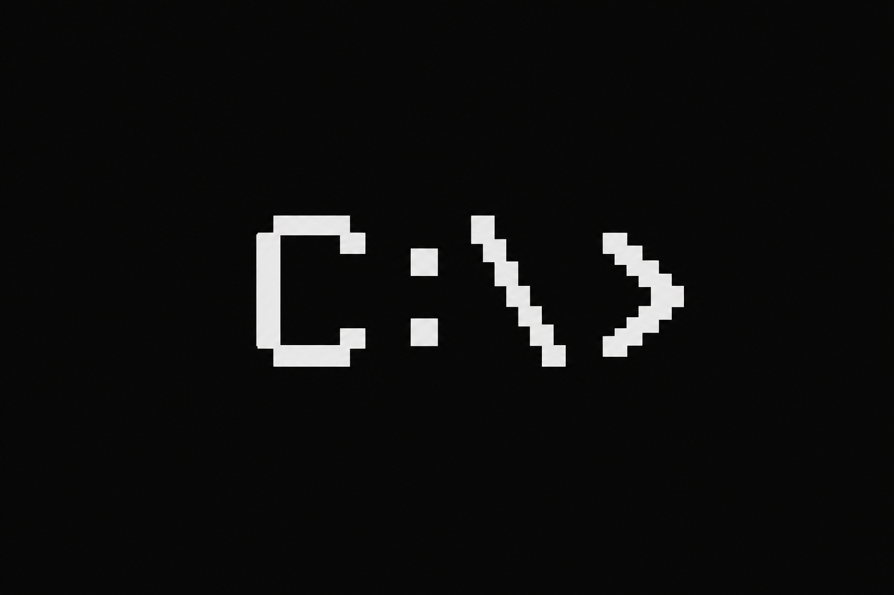

**Languages:** [English (en_US)](README.md) · [Português (pt_BR)](README.pt-BR.md) · [toki pona](README.tok.md)

**License:** [GPL-3.0-or-later](LICENSE) · **GitHub:** `git@github.com:lgallindo/hardcopy-console.git`

## What is this?

An on-page console that watches a JSON log over HTTP. Your app keeps a short list of log lines; this widget polls that list and shows it in a terminal-style panel with timestamps.

It is not a DOS or CP/M emulator—only the look and the polling UI. The project is **hardcopy-console** (JS API `HardcopyConsole`).

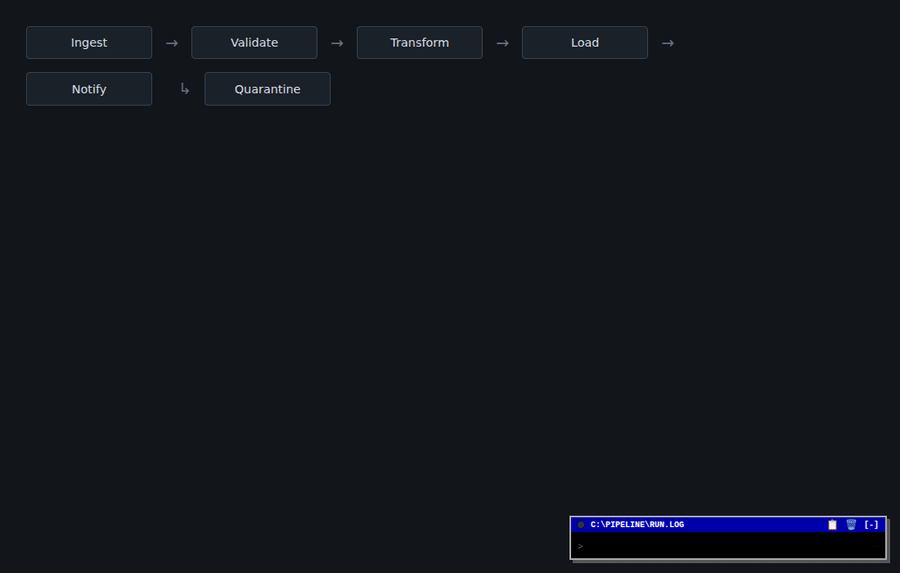

### Use cases

- Watch API and page activity while you develop
- Put a shared audit panel on a Flask, FastAPI, or static page
- Workshop demos of request flow without a full observability stack
- Lab themes that reuse the same console (CP/M-ish, Simple.css, Water.css, …)

**Enterprise** (secondary):

- **Release / deploy desk** — promote, health check, and rollback as timestamped lines on an internal ops page:

  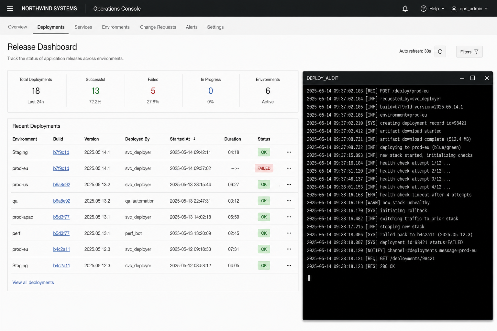

- **Back-office / CRM actions** — who changed risk flags, overrides, and account fields, with times you can re-read:

  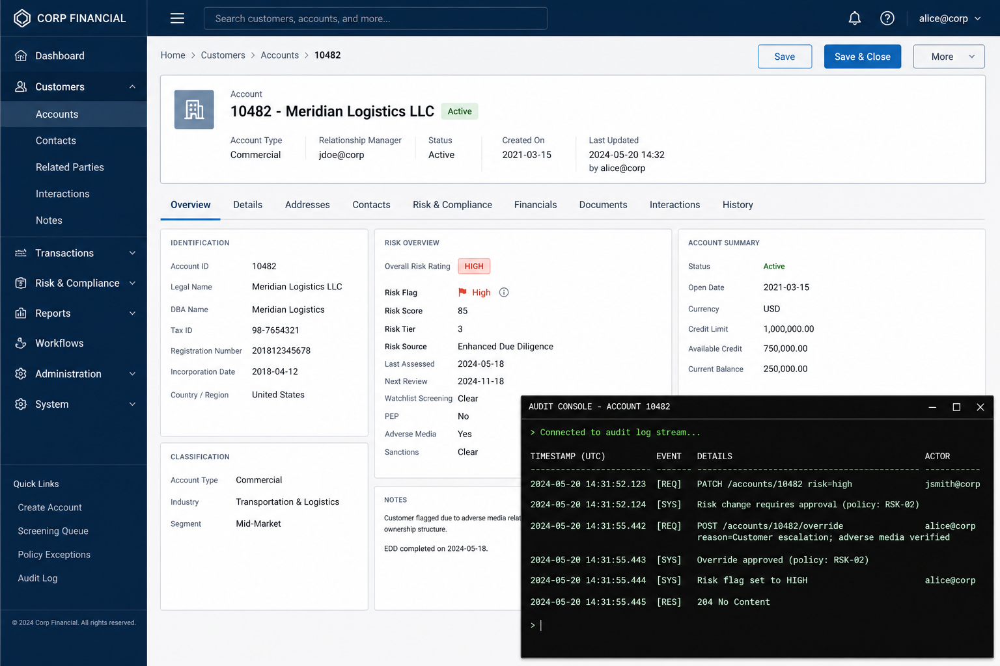

**Chat / mail:**

- Inbound messages as lines (`mail from…`, `chat #general: …`) so history scrolls in one place instead of popups:

  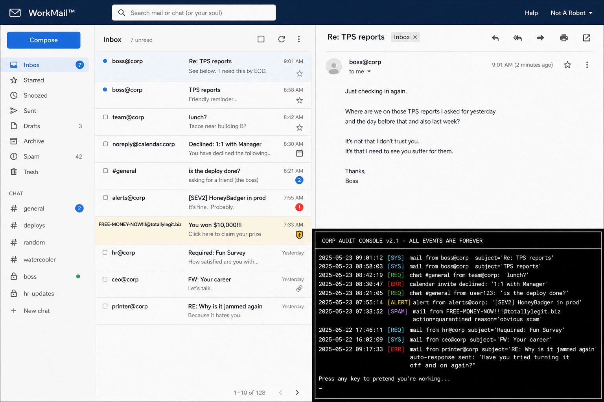

## Why this exists

I made this because I hate toasts. I need timestamped notifications to understand my apps. It might be trauma from when some data pipeline tool my employer developed had lime green toasts as the only logging tool. The only thing I hate more than toast are heavy JS frameworks, so Vanilla JS it is.

---

## Monitor example

Your app appends log lines to a ring buffer. The widget calls `GET /api/v1/logs`, gets a JSON array, and paints it.

```json
{"time": "14:32:01.423", "msg": "[REQ] GET /health", "type": "req"}
```

(`type` is usually `req`, `res`, `sys`, or `err` — see [SPEC.md](SPEC.md).)

**Client:** ship CSS + IIFE from `dist/`, mount on a `div`, set `logsUrl`:

```html
<link rel="stylesheet" href="dist/hardcopy-console.css">
<div id="hardcopy-root"></div>
<script src="dist/hardcopy-console.iife.js"></script>
<script>
  HardcopyConsole.mount('#hardcopy-root', {
    logsUrl: '/api/v1/logs',
    pollMs: 3000,
    title: 'C:\\> MONITOR'
  });
</script>
```

**Server:** return that JSON array. Python: [adapters/](adapters/) (`LogBuffer`, Flask, FastAPI). Do not audit every poll of `/logs`, or the console floods itself.

---

## See it working

GitHub READMEs cannot run JavaScript. These are recordings of the sample apps; run the live ones with the harness below.

**Echo lab** — a message lands in the polled log:

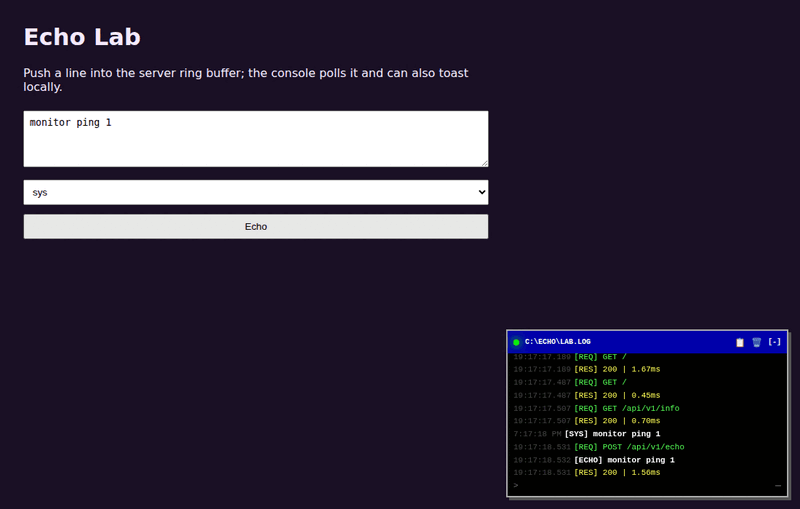

[`examples/echo-lab/`](examples/echo-lab/) → http://127.0.0.1:8773/ (after `./harness/run.sh`)

**Net status** — refresh host info; each refresh is logged:

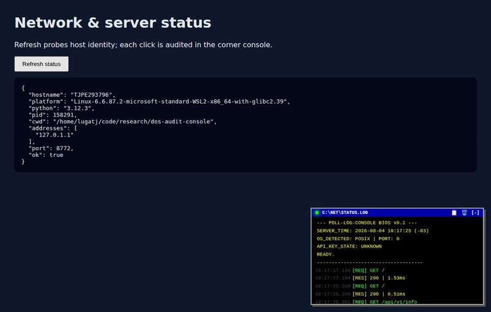

[`examples/net-status/`](examples/net-status/) → http://127.0.0.1:8772/

### Console tricks

Minimize / expand with the header (`:q` also minimizes). New events can flash the header light and append a timestamped line (the anti-toast). The panel is `position: fixed`—move it with CSS (`left` / `right` / `bottom`) when you want another corner.

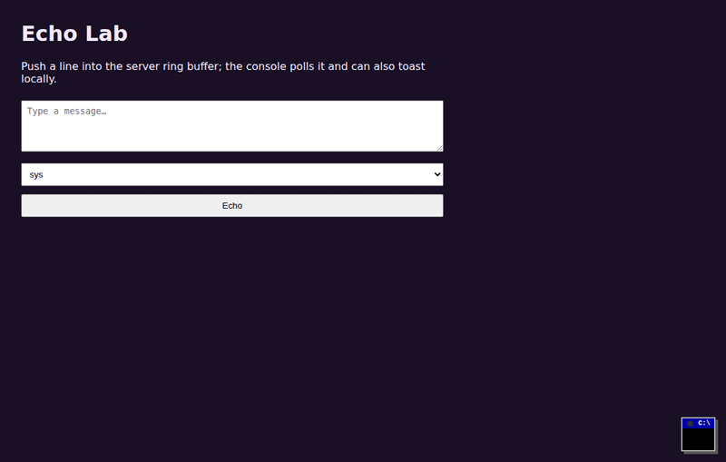

---

## Hook it up

1. Use `dist/hardcopy-console.css` and `dist/hardcopy-console.iife.js`.
2. Add a mount `div` (any selector).
3. Call `HardcopyConsole.mount` with at least `logsUrl` (and usually `pollMs`).
4. Serve `LogEntry[]` JSON — Python helpers under `src/python/hardcopy_console/` and [adapters/](adapters/).
5. Exclude `/logs` and static paths from audit middleware.
6. Run `./harness/run.sh` for the five local demos (ports 8771–8775).

Then use the quick start and sample index below.

---

## Goals

- Pure CSS + IIFE JS (no mandatory Alpine, Tailwind, or npm at runtime)
- Drop into Flask, FastAPI (Jinja), Alpine.js, vanilla JS, HTMX, and [lwan](https://lwan.ws/)
- Shared `LogEntry` JSON contract + optional Python `LogBuffer` / middleware

## Quick start (vanilla)

```html
<link rel="stylesheet" href="dist/hardcopy-console.css">
<div id="hardcopy-root"></div>
<script src="dist/hardcopy-console.iife.js"></script>
<script>
  HardcopyConsole.mount('#hardcopy-root', {
    logsUrl: '/api/v1/logs',
    infoUrl: '/api/v1/info',
    pollMs: 3000,
    title: 'C:\\> MONITOR'
  });
</script>
```

See [SPEC.md](SPEC.md) and [adapters/](adapters/).

---

## Sample apps (index)

| Preview | App | Path | Port | What it does |
|---------|-----|------|------|----------------|
| 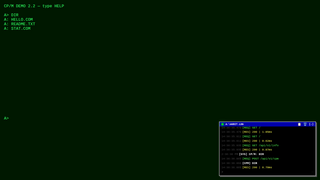 | **CP/M term** | [`examples/cpm-term/`](examples/cpm-term/) | **8771** | Toy CP/M prompt (`DIR`, `TYPE`, `HELP`); commands are audited |
| 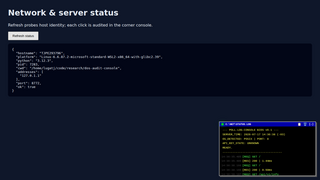 | **Net status** | [`examples/net-status/`](examples/net-status/) | **8772** | Hostname, addresses, platform, PID; refresh hits the log |
| 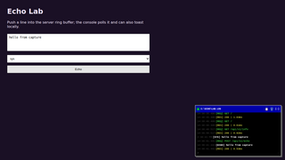 | **Echo lab** | [`examples/echo-lab/`](examples/echo-lab/) | **8773** | POST a message into the ring buffer + local toast/LED |
| 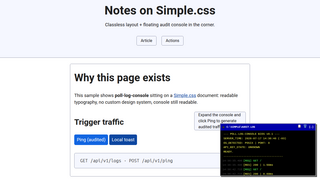 | **Simple.css** | [`examples/simple-css/`](examples/simple-css/) | **8774** | Console on a [Simple.css](https://simplecss.org/) page |
| 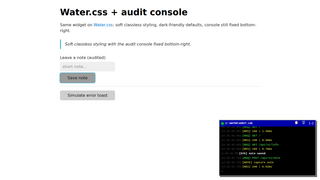 | **Water.css** | [`examples/water-css/`](examples/water-css/) | **8775** | Console on a [Water.css](https://watercss.kognise.dev/) page |

Also present (stubs): `examples/vanilla-standalone/`, `alpine-standalone/`, `flask-app/`, `fastapi-app/`, `htmx-poll/`, `lwan/`.

### Run the sample apps

```bash
python3 -m venv .venv && .venv/bin/pip install fastapi uvicorn
chmod +x harness/run.sh
./harness/run.sh
```

- http://127.0.0.1:8771/ — CP/M  
- http://127.0.0.1:8772/ — Net status  
- http://127.0.0.1:8773/ — Echo lab  
- http://127.0.0.1:8774/ — Simple.css  
- http://127.0.0.1:8775/ — Water.css  

Or one at a time:

```bash
cd examples/cpm-term && PYTHONPATH=../../src/python python3 app.py
cd examples/net-status && PYTHONPATH=../../src/python python3 app.py
cd examples/echo-lab && PYTHONPATH=../../src/python python3 app.py
cd examples/simple-css && PYTHONPATH=../../src/python python3 app.py
cd examples/water-css && PYTHONPATH=../../src/python python3 app.py
```

Details: [harness/README.md](harness/README.md).

---

## Layout

| Path | Role |
|------|------|
| `src/` | CSS, JS core + adapters, HTML fragments, Python package |
| `dist/` | Offline-ready CSS + IIFE |
| `adapters/` | Notes per host (Flask, FastAPI, Alpine, Vanilla, HTMX, lwan) |
| `examples/` | Sample applications |
| `harness/` | Start and check sample apps |
| `tests/` | Unit + e2e notes |
| `docs/media/brand/` | GitHub banner + mark + social shorts |
| `docs/media/demo/` | README demos and use-case stills |

## License

[GPL-3.0-or-later](LICENSE) — see also [COPYING.short](COPYING.short).
