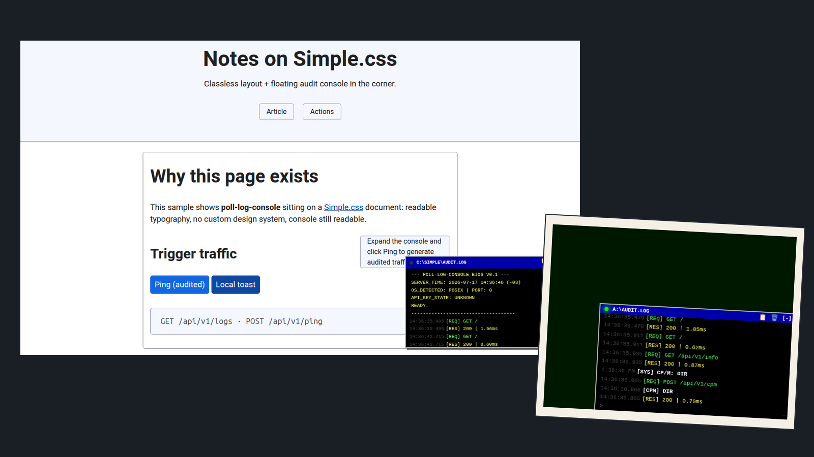
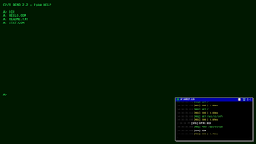
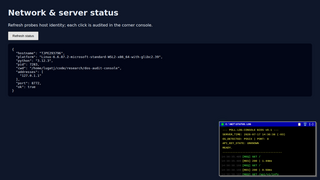
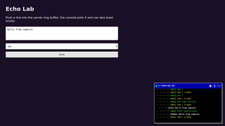
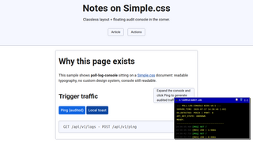
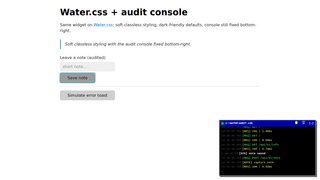

# poll-log-console

**toki:** [English (en_US)](README.md) · [Português (pt_BR)](README.pt-BR.md) · [toki pona](README.tok.md)

ni li **ilo lukin pi lipu pali HTTP**. ona li kama jo e sona kepeken tenpo mute (poll).  
sitelen li lukin sama ilo toki pi tenpo pini. ona li **ala** sama ilo CP/M anu DOS.

**lipu lawa:** [GPL-3.0-or-later](LICENSE)

**ma GitHub:** `git@github.com:lgallindo/poll-log-console.git`



---

## wile

- CSS en IIFE taso
- ken lon Flask, FastAPI, Alpine, JS, HTMX, [lwan](https://lwan.ws/)
- nasin JSON `LogEntry` · ken kepeken e `LogBuffer` pi toki Python

## open lili (JS)

```html
<link rel="stylesheet" href="dist/dos-audit-console.css">
<div id="dos-root"></div>
<script src="dist/dos-audit-console.iife.js"></script>
<script>
  DosAuditConsole.mount('#dos-root', {
    logsUrl: '/api/v1/logs',
    infoUrl: '/api/v1/info',
    pollMs: 3000,
    title: 'C:\\SYSTEM\\AUDIT_LOG.EXE'
  });
</script>
```

o lukin e [SPEC.md](SPEC.md) e [adapters/](adapters/).

---

## ilo ante (nanpa)

| lukin | ilo | nasin | nanpa port | seme |
|-------|-----|-------|------------|------|
|  | **CP/M term** | [`examples/cpm-term/`](examples/cpm-term/) | **8771** | musi CP/M |
|  | **Net status** | [`examples/net-status/`](examples/net-status/) | **8772** | sona pi linja en ilo |
|  | **Echo lab** | [`examples/echo-lab/`](examples/echo-lab/) | **8773** | o pana e toki |
|  | **Simple.css** | [`examples/simple-css/`](examples/simple-css/) | **8774** | sitelen lon Simple.css |
|  | **Water.css** | [`examples/water-css/`](examples/water-css/) | **8775** | sitelen lon Water.css |

### o open e ilo ante

```bash
python3 -m venv .venv && .venv/bin/pip install fastapi uvicorn
chmod +x harness/run.sh
./harness/run.sh
```

- http://127.0.0.1:8771/ — CP/M  
- http://127.0.0.1:8772/ — sona pi linja  
- http://127.0.0.1:8773/ — Echo lab  
- http://127.0.0.1:8774/ — Simple.css  
- http://127.0.0.1:8775/ — Water.css  

sona mute: [harness/README.md](harness/README.md).

---

## lipu

| nasin | seme |
|-------|------|
| `src/` | CSS, JS, HTML, Python |
| `dist/` | lipu tawa kepeken |
| `adapters/` | sona pi nasin ante |
| `examples/` | ilo ante |
| `harness/` | open e lukin e ilo ante |
| `tests/` | test |

## lipu lawa

[GPL-3.0-or-later](LICENSE).
